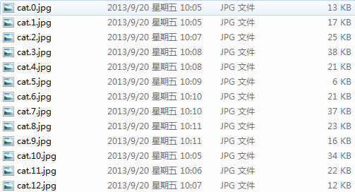
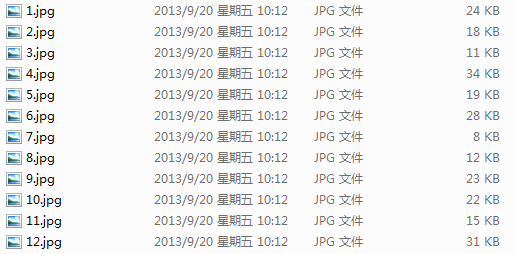

# Dogs vs. Cats (kaggle 猫狗大战)

Create an algorithm to distinguish dogs from cats.

正如上面这句话所说，我们的目的就是创建一个算法，来对混合猫狗图片的数据集中，将猫和狗分别识别出来。

## 一、简介

猫狗大战这个项目其实与我们之前做的数字识别类似，只不过是图片复杂了一些。当然，我们这次使用深度学习，来完成我们想要做的事情。

## 二、安装包/第三方库要求

 - Python 3.x
 - Pytorch

## 三、数据预处理

### 1、本次的数据来自 kaggle 的比赛项目 [dogs-vs-cats](https://www.kaggle.com/c/dogs-vs-cats)

### 2、查看数据格式

 - 训练数据



 - 训练数据集 - 说明：训练数据集中的数据，是经过人工标记的数据，类别和数字之间使用的 "." （点）做的分隔。

 - 测试数据



 - 测试数据集 - 说明：测试数据集中的数据，是没有经过人工标记的数据，没有对应的类别，只有一些相应的数字号码。

### 3、对数据的预处理

#### 3.1、提取训练 & 测试数据集的编号

训练数据集 & 测试数据集 给出的序号和 label 都是在文件名称中。

```python
imgs = [os.path.join(root, img) for img in os.listdir(root)]

        # test1：即测试数据集， D:/dataset/dogs-vs-cats/test1
        # train: 即训练数据集，D:/dataset/dogs-vs-cats/train
        if self.test:
            # 提取 测试数据集的序号，
            # 如 x = 'd:/path/123.jpg'，
            # x.split('.') 得到 ['d:/path/123', 'jpg'] 
            # x.split('.')[-2] 得到 d:/path/123
            # x.split('.')[-2].split('/') 得到 ['d:', 'path', '123']
            # x.split('.')[-2].split('/')[-1] 得到 123
            imgs = sorted(imgs, key=lambda x: int(x.split('.')[-2].split('/')[-1]))
        else:
            # 如果不是测试集的话，就是训练集，我们只切分一下，仍然得到序号，123
            imgs = sorted(imgs, key=lambda x: int(x.split('.')[-2]))
```

#### 3.2、划分训练集 & 验证集

首先我们知道我们手里的数据现在只有训练集和测试集，并没有验证集。那么为了我们训练得到的模型更好地拟合我们的测试数据，我们人为地将训练数据划分为 训练数据 + 验证数据（比例设置为 7:3）

```python
# 获取图片的数量
        imgs_num = len(imgs)

        # 划分训练、验证集，验证集:训练集 = 3:7
        # 判断是否为测试集
        if self.test:
            # 如果是 测试集，那么 就直接赋值
            self.imgs = imgs
        # 判断是否为 训练集
        elif train:
            # 如果是训练集，那么就把数据集的开始位置的数据 到 70% 部分的数据作为训练集
            self.imgs = imgs[:int(0.7 * imgs_num)]
        else:
            # 这种情况就是划分验证集啦,从 70% 部分的数据 到达数据的末尾，全部作为验证集
            self.imgs = imgs[int(0.7 * imgs_num):]
```

#### 3.3、测试集，验证集和训练集的数据转换

```python
        # 数据的转换操作，测试集，验证集，和训练集的数据转换有所区别
        if transforms is None:
            # 如果转换操作没有设置，那我们设置一个转换 
            normalize = T.Normalize(mean=[0.485, 0.456, 0.406], std=[0.229, 0.224, 0.225])
            # 测试集 和 验证集 的转换
            # 判断如果是测试集或者不是训练集（也就是说是验证集），就应用我们下边的转换
            if self.test or not train:
                self.trainsforms = T.Compose([T.Resize(224), T.CenterCrop(224), T.ToTensor(), normalize])
            else:
                # 如果是训练集的话，使用另外的转换
                self.transforms = T.Compose([T.Resize(256), T.RandomResizedCrop(224), T.RandomHorizontalFlip(), T.ToTensor(), normalize])
```

#### 3.4、重写子类 / 函数

这里我们使用了 torch.utils.data 中的一些函数，比如 Dataset

class torch.utils.data.Dataset 表示 Dataset 的抽象类，所有其他的数据集都应继承该类。所有子类都应该重写 __len__ ，提供数据集大小的方法，和 __getitem__ ，支持从 0 到 len(self) 整数索引的方法。

```python
    def __len__(self):
        return len(self.imgs)

    def __getitem__(self, index):
        img_path = self.imgs[index]
        # 判断，如果是测试集的数据的话，那就返回对应的序号，比如 d:path/123.jpg 返回 123
        if self.test:
            label = int(self.imgs[index].split('.')[-2].split('/')[-1])
        else:
            # 如果不是测试集的数据，那么会有相应的类别（label），也就是对应的dog 和 cat，dog 为 1，cat 为0
            label = 1 if 'dog' in img_path.split('/')[-1] else 0
        # 这里使用 Pillow 模块，使用 Image 打开一个图片
        data = Image.open(img_path)
        # 使用我们定义的 transforms ，将图片转换，详情参考：https://pytorch.org/docs/stable/torchvision/transforms.html#transforms-on-pil-image
        # 默认的 transforms 设置的是 none
        data = self.transforms(data)
        # 将转换完成的 data 以及对应的 label（如果有的话），返回
        return data,label
```

#### 3.5、数据加载

```python
# 训练数据集的路径
train_path = 'D:/dataset/dogs-vs-cats/train'
# 从训练数据集的存储路径中提取训练数据集
train_dataset = GetData(train_path, train=True)
# 将训练数据转换成 mini-batch 形式
load_train = data.DataLoader(train_dataset, batch_size=20, shuffle=True, num_workers=1)

# 测试数据的获取
# 首先设置测试数据的路径
test_path = 'D:/dataset/dogs-vs-cats/test1'
# 从测试数据集的存储路径中提取测试数据集
test_path = GetData(test_path, test=True)
# 将测试数据转换成 mini-batch 形式
loader_test = data.DataLoader(test_dataset, batch_size=3, shuffle=True, num_workers=1)
```

## 四、构建 CNN 模型

```python
# 调用已经写好的 AlexNet() 模型
cnn = AlexNet()
# 将模型打印出来观察一下
print(cnn)
```

## 五、设置相应的优化器和损失函数

我们已经构造完成了 CNN 模型，并将我们所需要的数据进行了相应的预处理。那我们接下来的一步就是定义相应的损失函数和优化函数。

torch.optim 是一个实现各种优化算法的软件包。

```python
# 设置优化器和损失函数
# 这里我们使用 Adam 优化器，使用的损失函数是 交叉熵损失
optimizer = torch.optim.Adam(cnn.parameters(), lr=0.005, betas=(0.9, 0.99))  # 优化所有的 cnn 参数
loss_func = nn.CrossEntropyLoss()  # 目标 label 不是 one-hotted 类型的
```

## 六、训练模型

数据以及相对应的损失函数和优化器，我们都已经设置好了，那接下来就是紧张刺激的训练模型环节了。

```python
# 训练模型
# 设置训练模型的次数，这里我们设置的是 10 次，也就是用我们的训练数据集对我们的模型训练 10 次，为了节省时间，我们可以只训练 1 次
EPOCH = 10
# 训练和测试
for epoch in range(EPOCH):
        num = 0
        # 给出 batch 数据，在迭代 train_loader 的时候对 x 进行 normalize
        for step, (x, y) in enumerate(loader_train):
            b_x = Variable(x)  # batch x
            b_y = Variable(y)  # batch y

            output = cnn(b_x)  # cnn 的输出
            loss = loss_func(output, b_y)  # 交叉熵损失
            optimizer.zero_grad()  # 在这一步的训练步骤上，进行梯度清零
            loss.backward()  # 反向传播，并进行计算梯度
            optimizer.step()  # 应用梯度

            # 可以打印一下
            # print('-'*30, step)
            if step % 20 == 0:
                num += 1
                for _, (x_t, y_test) in enumerate(loader_test):
                    x_test = Variable(x_t)  # batch x
                    test_output = cnn(x_test)
                    pred_y = torch.max(test_output, 1)[1].data.squeeze()
                    accuracy = sum(pred_y == y_test) / float(y_test.size(0))
                    print('Epoch: ', epoch, '| Num: ',  num, '| Step: ',  step, '| train loss: %.4f' % loss.data[0], '| test accuracy: %.4f' % accuracy)
```